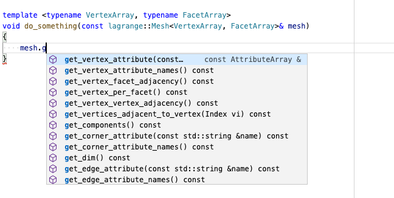

# Autocompletion With Clangd

Are you coding in a text editor like Vim/NeoVim, VSCode, Sublime, and miss powerful IDE features
such as provided by Visual Studio? The new kid in the block for intelligent autocompletion and smart
code editing is [clangd](https://clangd.llvm.org/).

## Retrieve LLVM and Clangd

clangd is part of the LLVM project, so it should be present on your machine if you have a local
installation of llvm-clang. However, due to certain
[issues](https://github.com/clangd/clangd/issues/333) with header-only code completion, as of today
(05-18-20) we need to compile LLVM from source and patch it manually for it to work well with
Lagrange:

1. Clone the LLVM git repository (we used `7ee479a76` as of this writing)
    ```
    git clone --depth 1 https://github.com/llvm/llvm-project.git
    cd llvm-project
    ```

2. Download and apply patch for [this issue](https://github.com/clangd/clangd/issues/333) (if still
   applicable)
    ```
    wget https://reviews.llvm.org/file/data/p524ff355qzqwqvmqoiy/PHID-FILE-agyvgty5nzpa5wvyoice/D78038.diff
    git apply D78038.diff
    ```

3. Build clang and clangd:
    ```
    mkdir build
    cd build
    cmake -G Ninja -DCMAKE_BUILD_TYPE=Release -DCMAKE_INSTALL_PREFIX=/usr/local/opt/llvm-git lang -DLLVM_ENABLE_PROJECTS="clang;clang-tools-extra;libcxx;libcxxabi;polly;lldb;lld;compiler-rt" ../llvm
    ninja
    ninja install
    ```
    You can change the install directory from `/usr/local/opt/llvm-git` to suit your preference.

## Install Editor Plugin For Clangd

Please check out the [clangd website](https://clangd.llvm.org/installation.html) for instructions on
how to install the clangd plugin for your favorite editor. In this tutorial we will use VSCode.
Users of Vim/NeoVim can also check out [coc.vim](https://github.com/neoclide/coc.nvim).

For the VSCode plugin, do not forget to set the `clangd` path to the binary compiled in the previous
step:
```
"clangd.path": "/usr/local/opt/llvm-git/bin/clangd"
```

Also the `compile_commands.json` file should be in your project root folder, and the default
Microsoft C/C++ plugin (Intellisense...) must be uninstalled or disabled.

## Configure Your Project

### CMake

Make sure you configure your CMake project with the following options:

```cmake
# Generates a `compile_commands.json` that can be used for autocompletion
set(CMAKE_EXPORT_COMPILE_COMMANDS ON CACHE BOOL "Enable/Disable output of compile commands during generation.")

# Use a specific C/C++ compiler, e.g. llvm-clang on macOS (so we can use clangd)
set(CMAKE_C_COMPILER   "/usr/local/opt/llvm-git/bin/clang" CACHE STRING "C compiler" FORCE)
set(CMAKE_CXX_COMPILER "/usr/local/opt/llvm-git/bin/clang++" CACHE STRING "C++ compiler" FORCE)
```

You can also pass those options via the command line when you first configure your project (`cmake
-DCMAKE_CXX_COMPILER=<...> ..`). For Lagrange, you can put those lines in a file
`LagrangeOptions.cmake` at the root of the repository. When configuring your own CMake project, make
sure the `CMAKE_CXX_COMPILER` cache variable is set *before* the first call to `project()` in your
CMake script.

### Xcode

If you have an xcode project (generated by gyp or metabuild) for example, you can use xcpretty to
generate the `compile_commands.json` (thanks to this
[link](https://stackoverflow.com/questions/25444277/xcodebuild-generating-empty-compile-commands-json)).

- Install xcpretty `sudo gem install xcpretty`.
- Clean up your project
```
xcodebuild clean -project /path/to/project.xcodeproj -scheme main/scheme/name
```
- Generate the compile commands
```
xcodebuild -project /path/to/project.xcodeproj -scheme main/scheme/name | xcpretty -r json-compilation-database -o compile_commands.json
```

## Better Completion Database

By default, the `compile_commands.json` generated by CMake only contains compilation instructions
for each translation unit in your project. We will use [compdb](https://github.com/Sarcasm/compdb)
to generate a new compilation database that includes header files.

1. Install [compdb](https://github.com/Sarcasm/compdb) using pip:
    ```
    pip install --user compdb
    ```
    You can also install compdb via [conda](https://docs.conda.io/en/latest/miniconda.html) using
    the following environment:
    ```
    name: compdb
    dependencies:
      - python=3.7
      - pip
      - pip:
        - compdb
    ```

2. Generate a new completion database containing header files:
    ```
    python -m compdb -p /folder/containing/initial/compile_commands.json list > compile_commands.json
    ```
    This last step needs to be re-run anytime you add a new file to your project, or change any
    compilation options.

## Enjoy!


