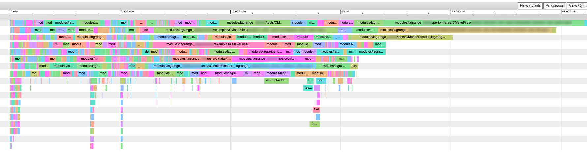
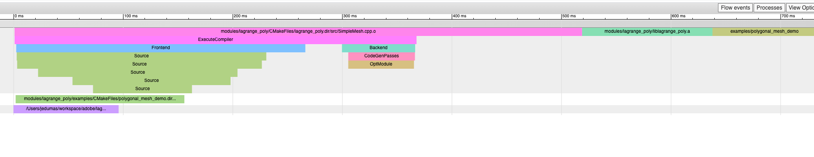

# Profiling Compilation Times

Who doesn't love a slow compiling C++ project? Here are some simple tools to help you figure out
which part of your project takes the cake when it comes to compilation times. Once you have a better
idea of what to improve, head over to our [Speeding Up Compilation](speeding-up-compilation.md) page
for some tips on how to improve this.

## Using Ninja

When compiling a CMake project using Ninja instead of Make or MSBuild, one can use
[ninjatracing](https://github.com/nico/ninjatracing) to convert ninja log files to chrome's
`about:tracing` format:







To build a project with Ninja, simply use the `-G Ninja` when generating the build system:

```bash
mkdir build
cd build
cmake -G Ninja ..
ninja # Or Cmake --Build .
```

!!! tip "Windows & Ninja"
    The Ninja generator is also available on Windows. Make sure you are in a x64 Visual Studio
    Developer Command Prompt before running `cmake -G ...`.

Once you have build your project with Ninja, you can convert the log files with
[ninjatracing](https://github.com/nico/ninjatracing):

```bash
ninjatracing $BUILD_DIR/.ninja_log > trace.json
```

Open the resulting `trace.json` in Chrome (`about:tracing`).

!!! note "Incremental Compilation"
    When incrementally compiling an existing project, only newly compiled files will appear in the
    `trace.json` file produced by ninjatracing.

## Using Clang + Ninja

When compiling with clang, one can use the
[-ftime-trace](https://aras-p.info/blog/2019/01/16/time-trace-timeline-flame-chart-profiler-for-Clang/)
flag to get detailed information on where clang spends most of its time compiling your project:

```bash
cmake -G Ninja -DCMAKE_CXX_FLAGS="-ftime-trace" ..
ninja
```

Then, simply add `-e` to the `ninjatracing` call:

```bash
ninjatracing -e $BUILD_DIR/.ninja_log > trace.json
```

Open the resulting trace file in Chrome:


## Using The Clang Build Analyzer

Go to the [Clang Build Analyzer](https://github.com/aras-p/ClangBuildAnalyzer) repository and
compile the tool, then simply follow the instructions in the README (copied below):

### Usage

1. **Start the build capture**: `ClangBuildAnalyzer --start <artifacts_folder>`<br/>
   This will write current timestamp in a `ClangBuildAnalyzerSession.txt` file under the given `artifacts_folder`. The artifacts
   folder is where the compiled object files (and time trace report files) are expected to be produced by your build.
2. **Do your build**. Does not matter how; an IDE build, a makefile, a shell script, whatever. As long as it invokes
   Clang and passes `-ftime-trace` flag to the compiler (**Clang 9.0 or later is required** for this).
3. **Stop the build capture**: `ClangBuildAnalyzer --stop <artifacts_folder> <capture_file>`<br/>
   This will load all Clang time trace compatible `*.json` files under the given `artifacts_folder` that were modified after
   `--start` step was done (Clang `-ftime-trace` produces one JSON file next to each object file), process them and store data file into
   a binary `capture_file`.
4. **Run the build analysis**: `ClangBuildAnalyzer --analyze <capture_file>`<br/>
   This will read the `capture_file` produced by `--stop` step, calculate the slowest things and print them. If a
   `ClangBuildAnalyzer.ini` file exists in the current folder, it will be read to control how many of various things to print.

Aternatively, instead of doing `--start` and `--stop` steps, you can do `ClangBuildAnalyzer --all <artifacts_folder> <capture_file>` after your build; that will
include all the compatible `*.json` files for analysis, no matter when they were produced.


### Analysis Output

The analysis output will look something like this:

```
Analyzing build trace from 'artifacts/FullCapture.bin'...
**** Time summary:
Compilation (1761 times):
  Parsing (frontend):         5167.4 s
  Codegen & opts (backend):   7576.5 s

**** Files that took longest to parse (compiler frontend):
 19524 ms: artifacts/Modules_TLS_0.o
 18046 ms: artifacts/Editor_Src_4.o
 17026 ms: artifacts/Modules_Audio_Public_1.o
 16581 ms: artifacts/Runtime_Camera_4.o

**** Files that took longest to codegen (compiler backend):
145761 ms: artifacts/Modules_TLS_0.o
123048 ms: artifacts/Runtime_Core_Containers_1.o
 56975 ms: artifacts/Runtime_Testing_3.o
 52031 ms: artifacts/Tools_ShaderCompiler_1.o

**** Templates that took longest to instantiate:
 19006 ms: std::__1::basic_string<char, std::__1::char_traits<char>, std::__1::... (2665 times, avg 7 ms)
 12821 ms: std::__1::map<core::basic_string<char, core::StringStorageDefault<ch... (250 times, avg 51 ms)
  9142 ms: std::__1::map<core::basic_string<char, core::StringStorageDefault<ch... (432 times, avg 21 ms)
  8515 ms: std::__1::map<int, std::__1::pair<List<ListNode<Behaviour> > *, List... (392 times, avg 21 ms)

**** Functions that took longest to compile:
  8710 ms: yyparse(glslang::TParseContext*) (External/ShaderCompilers/glslang/glslang/MachineIndependent/glslang_tab.cpp)
  4580 ms: LZ4HC_compress_generic_dictCtx (External/Compression/lz4/lz4hc_quarantined.c)
  4011 ms: sqlite3VdbeExec (External/sqlite/sqlite3.c)
  2737 ms: ProgressiveRuntimeManager::Update() (artifacts/Editor_Src_GI_Progressive_0.cpp)

*** Expensive headers:
136567 ms: /BuildEnvironment/MacOSX10.14.sdk/System/Library/Frameworks/Foundation.framework/Headers/Foundation.h (included 92 times, avg 1484 ms), included via:
  CocoaObjectImages.o AppKit.h  (2033 ms)
  OSXNativeWebViewWindowHelper.o OSXNativeWebViewWindowHelper.h AppKit.h  (2007 ms)
  RenderSurfaceMetal.o RenderSurfaceMetal.h MetalSupport.h Metal.h MTLTypes.h  (2003 ms)
  OSXWebViewWindowPrivate.o AppKit.h  (1959 ms)
  ...

112344 ms: Runtime/BaseClasses/BaseObject.h (included 729 times, avg 154 ms), included via:
  PairTests.cpp TestFixtures.h  (337 ms)
  Stacktrace.cpp MonoManager.h GameManager.h EditorExtension.h  (312 ms)
  PlayerPrefs.o PlayerSettings.h GameManager.h EditorExtension.h  (301 ms)
  Animation.cpp MaterialDescription.h  (299 ms)
  ...

103856 ms: Runtime/Threads/ReadWriteLock.h (included 478 times, avg 217 ms), included via:
  DownloadHandlerAssetBundle.cpp AssetBundleManager.h  (486 ms)
  LocalizationDatabase.cpp LocalizationDatabase.h LocalizationAsset.h StringTable.h  (439 ms)
  Runtime_BaseClasses_1.o MonoUtility.h ScriptingProfiler.h  (418 ms)
  ...
```
