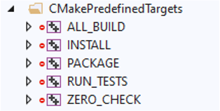

# Unit Tests



!!! warning "Artifactory Access"
    Building unit tests requires Artifactory to be setup. Please read our [Getting
    Started](../setup.md) page for instructions on how to configure your API key.



## Running Tests

When `LAGRANGE_UNIT_TESTS` is `ON`, unit tests are built automatically.
Running unit tests can be done either

- **Option 1** From the command-line in your build folder:

    ```sh
    ctest # or
    make test # or
    ninja test
    ```

- **Option 2** From Visual Studio or Xcode, by executing the special target `RUN_TESTS`:

    - **Visual Studio**

        

    - **Xcode**

         by passing the name(s) as argument to the test
    executable. For more details on the available command-line options, please refer to [this
    page](https://github.com/catchorg/Catch2/blob/devel/docs/command-line.md) of the Catch2
    documentation.
    )

    ```sh
    ./tests/test_lagrange_core "MeshCreation"
    ```

## Writing Unit Tests

Writing new unit tests should be pretty straightforward. Please refer to the [Catch2
documentation](https://github.com/catchorg/Catch2/blob/devel/docs/tutorial.md) to get you started.
However, there are some idiosyncrasies specifics to Lagrange:

- Unit test data is stored in a separate [data
  repository](https://github.com/adobe/lagrange-test-data). Assets are downloaded by CMake, and can
  be loaded via the convenience function `lagrange::testing::load_mesh()`:

    ```cpp
    TEST_CASE("thicken_and_close_mesh stanford-bunny", "[mesh][thicken_and_close_mesh][stanford-bunny]")
    {
        auto mesh = lagrange::testing::load_mesh<TriangleMesh3Df>("open/core/stanford-bunny.obj");
        REQUIRE(...);
    }
    ```



- If a unit test in a public module (e.g. `lagrange::core`) needs to use non-public data, it may be
  disabled for the open-source version of Lagrange by using the **`LA_CORP_FLAG`** tag. For example:

    ```cpp
    TEST_CASE("ConnectivityInit_slow", "[Mesh][Connectivity][.slow]" LA_CORP_FLAG)
    {
        auto mesh = lagrange::testing::load_mesh<TriangleMesh3D>("corp/core/wing.obj");
        REQUIRE(...);
    }
    ```



- If a test may be failing, e.g., because it is a work in progress, you may use the
  **`LA_MAYFAIL_FLAG`** tag. Contrary to Catch2's `[!mayfail]`, our `LA_MAYFAIL_FLAG` tag expands to
  an empty string when Lagrange is compiled during continuous integration, in order to avoid
  reporting false positives.

    ```cpp
    TEST_CASE("Constrained Quadratic Problem 0", "[decimation]" LA_MAYFAIL_FLAG)
    {
        // ...
    }
    ```

## Writing Benchmarks

Benchmarking code should be written alongside regular unit tests, and be tagged with the special
flag `[!benchmark]`. Please read [this
page](https://github.com/catchorg/Catch2/blob/devel/docs/benchmarks.md) for detailed instructions
regarding Catch2's benchmarking macros.

By default, Catch2 runs benchmarks with 100 samples to produce accurate average timings. If your
benchmark takes some time to run, you might want to use fewer samples.



```sh
./tests/test_lagrange_hull "ConvexDecomposition: Benchmark" --benchmark-samples 10
```

## Unit Test Data & Artifactory

Please read our [dedicated page](../../corp/dev/artifactory.md) about working with unit test data and
Artifactory inside Lagrange.


