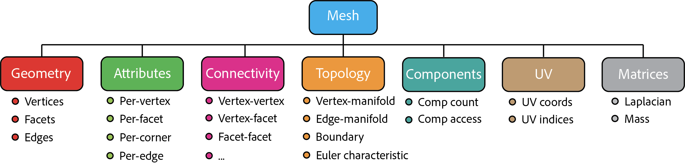

<!-- $ignore -->

# Legacy Mesh Class

<!-- @header @cpp
#include <lagrange/Mesh.h>
#include <lagrange/common.h>
-->

!!! warning "Legacy Mesh"
    Since v6.0.0, Lagrange introduced a new [polygonal mesh](mesh.md) class that is meant to
    replace the original mesh class used throughout Lagrange. The old `lagrange::Mesh<>` class is
    thus **deprecated**, but will be kept around for a while until we can transition all our code to
    the new data structure.

The [Mesh class] is one of the key data structures used in Lagrange.
It provides a standard representation of discretized (triangle or quad)
surfaces in 2D and 3D. It is used by nearly all Lagrange functionalities.

It consists of the following components

* **Geometry**: Vertices, facets, edges.
* **Attributes**: Scalar or vector field associated with vertices, faces, edges and corners (per vertex-facet pair).
* **Connectivity**: Vertex-vertex, vertex-facet, facet-facet, edge-facet adjacency matrices.
* **Topology**: Manifold/non-manifold check, boundary edge extraction.
* **Components**: Lists of facet indices that form connected components.
* **UV**: UV coordinates and indices.
* **Matrices**: Cache for discrete differential geometry matrices such as Laplacian.




## Terminology

Throughout the documentation, we will consistently use the following terms:

* A __vertex__ of a mesh is point on the surface.  It is typically defined by
  its coordinates (`(x,y,z)` in 3D and `(x,y)` in 2D).

* A __facet__ of a mesh is an oriented polygon that represent a piece of the
  surface. A facet is typically either a triangle or a quad.  It is defined by
  an ordered list of vertex indices that form its boundary (`[i,j,k]` for
  triangle and `[i,j,k,l]` for quad).

## Template Parameters

The [Mesh class]'s full signature is

```c++
lagrange::Mesh<VertexArray, FacetArray>;
```

It takes two template parameters, both are based on [Eigen] matrix type:

* `VertexArray` is the [Eigen] matrix type for representing vertex arrays. It is
  typically a `n` by `dim` matrix, where `n` is the number of vertices (or
  `Eigen::Dynamic`)
  and `dim` is either 2 or 3 depending on the dimension of the ambient space.
  `lagrange::Vertices2D` and `lagrange::Vertices3D` are two possible example
  types for `VertexArray` in 2D and 3D.

* `FacetArray`: is the [Eigen] matrix type for representing facet arrays.  It is
  typically a `m` by `s` matrix, where `m` is the number of facets (or
  `Eigen::Dynamic`) and `s` is the number of vertices per facet (3 for triangle
  mesh and 4 for quad mesh).  `lagrange::Triangles` and `lagrange::Quads` are
  two example types for `FacetArray`.

In addition to `VertexArray` and `FacetArray`, two important types are inferred:

* `Scalar` is the type for representing a floating point number. Typically it
  is `float` or `double`.  It is defined as the coefficient type of
  `VertexArray` (i.e. `VertexArray::Scalar`).

* `Index` is the type for representing a index. Typically, it is `int` or
  `size_t`.  It is defined as the coefficient type of `FacetArray` (i.e.
  `FacetArray::Scalar`).

!!! note
    In Lagrange, we often use the type alias `MeshType` to represent a
    specific instantiation of the [Mesh class]. It is equivalent to:

```c++
using MeshType = Mesh<VertexArray, FacetArray>;
```

## Naming Convention

Within this doc, we use the following naming convention when referring to mesh
objects:

* `mesh` is used for naming raw objects (`MeshType`).
* `mesh_ptr` is used for raw pointers  (`MeshType*`).
* `mesh_ref` is used for l-value references (`MeshType&`).
* `mesh_shared` is used for shared pointers (`std::shared_ptr<MeshType>`).
* `mesh_unique` is used for shared pointers (`std::unique_ptr<MeshType>`).

## Creation

It is easy to create a [Mesh][Mesh class] object from raw data:

```c++
// Generate raw data for a single triangle.
lagrange::Vertices3D vertices(3, 3);
vertices << 0.0, 0.0, 0.0,
            1.0, 0.0, 0.0,
            0.0, 1.0, 0.0;
lagrange::Triangles facets(1, 3);
facets << 0, 1, 2;

// Create a mesh object
auto mesh_unique = lagrange::create_mesh(vertices, facets);
```

The return type of `lagrange::create_mesh` method is a unique pointer of a
[Mesh][Mesh class] object.  Note in this case, the matrices `vertices` and
`facets` are copied into the `mesh` object.  If we are certain these matrices
will outlive the `mesh` object, we can avoid the copies with:

<!-- @preamble
lagrange::Vertices3D vertices;
lagrange::Triangles facets;
-->
```c++
auto mesh_unique = lagrange::wrap_with_mesh(vertices, facets);
```

If we want to [_move_](https://en.cppreference.com/w/cpp/utility/move) the data
from `vertices` and `facets` to the `mesh` object:

<!-- @preamble
lagrange::Vertices3D vertices;
lagrange::Triangles facets;
-->
```c++
auto mesh_unique = lagrange::create_mesh(
    std::move(vertices),
    std::move(facets));
```

A [Mesh class] object can also be loaded from a file. In this case, one needs
to explicitly specify the `VertexArray` and `FacetArray` types:

<!-- @group1 -->
```c++
using VertexArray = lagrange::Vertices3D;
using FacetArray = lagrange::Triangles;
using MeshType = lagrange::Mesh<VertexArray, FacetArray>;

auto mesh_unique = lagrange::load_mesh<MeshType>("filename.obj");
```

It is often necessary to convert a unique pointer to shared pointer or raw
pointer to invoke Lagrange functions.  It can be done easily:

<!-- @group1 -->
```c++
#include <lagrange/common.h>

// Get a reference
auto& mesh_ref = *mesh_unique;
// `mesh_ref` is of type `MeshType&`.

// Convert to shared_ptr.
auto mesh_shared = lagrange::to_shared_ptr(mesh_unique);
// `shared_mesh` is of type `std::shared_ptr<MeshType>`
assert(mesh_unique == nullptr);

// Get a raw pointer.
// Warning: Never (!!) wrap the same raw pointer into
// a new unique_ptr or shared_ptr.
MeshType* mesh_ptr = mesh_shared.get();
```

## Geometry

The [Mesh class] provides a number of handy functions for access geometric data
stored in it, for example:

<!-- @preamble
lagrange::TriangleMesh3D mesh; -->
```c++
const auto dim = mesh.get_dim();
const auto vertex_per_facet = mesh.get_vertex_per_facet();

const auto num_vertices = mesh.get_num_vertices();
const auto num_facets = mesh.get_num_facets();
```

To access the raw vertex/facet matrix:

```c++
const auto& vertices = mesh.get_vertices();
const auto& facets = mesh.get_facets();
```



!!! note
    As of Lagrange v2.3 release, the vertex and facet matrices are
    designed to be _immutable_. There is no support for update them using [Mesh
    class] API. This is subject to change in future releases.



## Connectivity

Connectivity can be optionally initialized and stored in the [Mesh class] as
adjacency lists. For example:

```c++
mesh.initialize_connectivity();
assert(mesh.is_connectivity_initialized());

// To get vertices adjacent to vertex v0:
const auto& v0_adj_vertices =
    mesh.get_vertices_adjacent_to_vertex(v0);

// To get facets adjacent to vertex v0:
const auto& v0_adj_facets =
    mesh.get_facets_adjacent_to_vertex(v0);

// To get facets adjacent to facet f0:
const auto& f0_adj_facets =
    mesh.get_facets_adjacent_to_facet(f0);

// Example usage:
for (const auto fi : f0_adj_facets) {
    // `fi` and `f0` are adjacent.
}
```

!!! note
    All returned values are of type `MeshType::IndexList`, which is an
    alias of `std::vector<MeshType::Index>`.

## Edge Data

An edge in lagrange is an object containing two vertex indices. `lagrange::EdgeType` takes an `Index` as a template parameter (e.g. `lagrange::EdgeType<int>(0, 1)`). `Edge` is defined in `lagrange::Mesh` class as an alias to `lagrange::EdgeType<Index>`.

Note that an edge does not define a direction, and `Edge(v1, v2) == Edge(v2, v1)`. Never use `Edge` to represent a directed edge.

Edge data can be initialized and stored in the [Mesh class]. This consists of the following data:

* `std::vector<Edge>`: A list of edges of the mesh. Edge indices indicate positions in this vector. Edge data below and edge attributes use the same indices.
* `std::vector<std::vector<Index>>`: Lists the facets adjacent to each edge.
* `std::unordered_map<Edge, Index>`: Maps each edge to its index.


```c++
mesh.initialize_edge_data();

const auto num_edges = mesh.get_num_edges();

bool boundary = mesh.get_is_edge_boundary({v1, v2});

// iterate over all edges
for (const auto& edge : mesh.get_edges()) {
}

// prefer using indices to avoid multiple map look-ups
for (Index e_idx = 0; e_idx < num_edges; ++e_idx) {
    for (auto Index f : mesh.get_edge_adjacent_facets(e_idx)) {
        // f is an adjacent facet
    }
}
```


## Components

A mesh could contain multiple connected components.  To extract connected
components:

```c++
mesh.initialize_components();
assert(mesh.is_components_initialized());

const auto num_comps = mesh.get_num_components();
const auto& comps = mesh.get_components();
assert(num_comps == comps.size());

// To access the first component:
const auto& comp_0 = comps.front();
for (const auto& fi : comp_0) {
    // Facet indexed by fi belongs to comp_0.
}
```

It is also possible to extract a mapping from facet indices to component
indices:

```c++
const auto& f_to_c_map = mesh.get_per_facet_component_ids();
assert(f_to_c_map.size() == mesh.get_num_facets());

const auto num_facets = mesh.get_num_facets();
for (Index fi=0; fi < num_facets; fi++) {
    // Facet fi belongs to component f_to_c_map[fi].
}
```

## Topology

A mesh is called _vertex-manifold_ if and only if the 1-ring neighborhood of all
its vertices are topologically equivalent to a disc.  Similarly, a mesh is
called _edge-manifold_ if and only if all of its edges are adjacent to at most 2
facets.

[Lagrange mesh][Mesh class] has build-in supports for querying these topological
properties:

```c++
mesh.initialize_topology();
assert(mesh.is_topology_initialized());

if (mesh.is_vertex_manifold()) {
    ...
}

if (mesh.is_edge_manifold()) {
    ...
}
```

!!! note
    Vertex-manifold is a stronger condition.  If a mesh is
    vertex-manifold, it is automatically implies it is also edge-manifold.

## UV

[Lagrange mesh][Mesh class] has direct support for UV coordinates:

```c++
assert(mesh.is_uv_initialized());

const auto& uv_coords = mesh.get_uv();
const auto& uv_indices = mesh.get_uv_indices();
```

The type of `uv_coords` is `MeshType::UVArray` and the type of `uv_indices` is
`MeshType::UVIndices`.  Both are predefined [Eigen] matrices using
`MeshType::Scalar` and `MeshType::Index` as scalar type. The `j`th vertex of
facet `i` has UV coordinates `uv_coords.row(uv_indices(i,j))`.

Together, `uv_coords` and `uv_indices` form a 2D mesh, which can be extracted:

```c++
assert(mesh.is_uv_initialized());
auto uv_mesh = mesh.get_uv_mesh();
```

It is also possible to erase existing UV and assign a new one:

```c++
mesh.clear_uv();
mesh.initialize_uv(uv_coords, uv_indices);
```

## Attributes

It is often useful to assign spatially varying scalar field or vector over the
surface of the mesh.  Lagrange's [Mesh class] support 4 types of attributes:

* Per-vertex attribute: One value per vertex.
* Per-facet attribute: One value per facet.
* Per-corner attributer: One value per vertex per facet.
* Per-edge attribute: One value per undirected edge.

All attributes has a name and are stored as `MeshType::AttributeArray`, which is
Eigen matrix of `MeshType::Scalar`.  For example, to create a custom per-vertex
attribute:

```c++
MeshType::AttributeArray attr(num_vertices, 1);
// Initialize the `attr` matrix.

mesh.add_vertex_attribute("attr_name");
mesh.set_vertex_attribute("attr_name", attr);
```

Attribute can be retrieved at any time from its name:

```c++
if (mesh.has_vertex_attribute("attr_name")) {
    const auto& attr =
        mesh.get_vertex_attribute("attr_name");
    assert(attr.rows() == mesh.get_num_vertices());
}
```

[Mesh class]: ../../../{{ dox_folder }}/classlagrange_1_1_mesh.html
[Eigen]: http://eigen.tuxfamily.org
