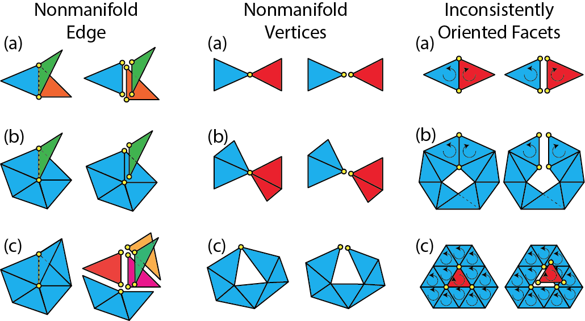

<!-- $ignore -->

# Mesh Cleanup

!!! attention
    Documentation on this page relies on our [legacy mesh](legacy-mesh.md) data structure.

Lagrange supports a number of mesh cleanup operations.  Typically, a mesh
cleanup operation takes an mesh object as input and creates a new [Mesh] object.
For example, all mesh cleanup functions have the same function signature:

```c++
auto out_mesh_unique = lagrange::function_name(in_mesh);
```

Therefore, it is possible to combine mesh cleanup operations by chaining them.
Existing vertex/facet/corner attributes can be seamless ported from the input
mesh to the output mesh.

!!! warning "Limitation"
    Edge attribute is not ported at the moment.

## Remove Isolated Vertices

An isolated vertex is a vertex that is not adjacent to any facet.  It can be
removed with `remove_isolated_vertex` function:

```c++
#include <lagrange/mesh_cleanup/remove_isolated_vertices.h>
auto mesh2_unique = lagrange::remove_isolated_vertices(
        mesh);
```

## Remove Duplicate Vertices

Two vertices are considered duplicates if they have _exactly_ the same
coordinates.  To remove duplicate vertices:

```c++
#include <lagrange/mesh_cleanup/remove_duplicate_vertices.h>
auto mesh_unique = lagrange::remove_duplicate_vertices(
        mesh);
```

It is also possible to add an extra condition when checking for vertex
duplicates.  By specifying a vertex attribute, two vertices are considered
duplicates if they have _exactly_ the same coordinates and attribute values.
For example:

```c++
#include <lagrange/mesh_cleanup/remove_duplicate_vertices.h>
auto mesh2_unique = lagrange::remove_duplicate_vertices(
    mesh, "color");
```

This call will remove all duplicate vertices that have the same coordinates and
color as defined by the "color" vertex attribute.

## Remove Degenerate Triangles

A triangle is called degenerate if all of its vertices are _exactly_ collinear.
Lagrange relies on exact predicates to check collinearity.

```c++
#include <lagrange/mesh_cleanup/remove_degenerate_triangles.h>
auto mesh2_unique = lagrange::remove_degenerate_triangles(
        mesh);
```

## Remove Topologically Degenerate Triangles

A triangle is called _topologically_ degenerate if two or more of its vertices
are the same topologically.  For example, a triangle `[1, 1, 2]` is
topologically degenerate because two of its vertices are referring to the same
vertex (the vertex with index `1`).  Topological degeneracy is a special case of
general degeneracy and it is possible to identify it from connectivity alone.

```c++
#include <lagrange/mesh_cleanup/remove_topologically_degenerate_triangles.h>
auto mesh2_unique = lagrange::remove_topologically_degenerate_triangles(
        mesh);
```

## Remove Short Edges

To remove all edges shorter than a given threshold:

```c++
#include <lagrange/mesh_cleanup/remove_short_edges.h>
auto mesh2_unqiue = lagrange::remove_short_edges(
        mesh, tol);
```

where `tol` is the target edge length threshold.


## Remove Duplicate Facets

Two facets are considered duplicates of each other if they are formed by the
combination of vertices.  E.g. facet `[1, 2, 3]` is considered as duplicate of
facet `[3, 2, 1]`.  To remove all duplicate facets:

```c++
#include <lagrange/mesh_cleanup/remove_duplicate_facets.h>
auto mesh2_unique = lagrange::remove_duplicate_facets(
        mesh);
```

!!! note
    Facet orientation is not considered.  Even thought facet `[1, 2, 3]`
    and `[3, 2, 1]` have opposite orientations, they are considered as duplicates.

## Split Long Edges

It is often that we need to refine a triangular mesh by splitting long edges:

```c++
#include <lagrange/mesh_cleanup/split_long_edges.h>
auto mesh2_unique = lagrange::split_long_edges(
    mesh, sq_tol, true);
```

Other than the input mesh, `lagrange::split_long_edges` takes two more
parameters:

* `sq_tol`: The target edge length squared.  All edges longer than this
  threshold will be split.
* `recursive`: Whether to split _recursively_.  Because edge splitting will
  introduce new edges and these new edges may be longer than the specified
  threshold. Splitting recursively will guarantee the output mesh contain no
  edge longer than the specified threshold.

!!! note
    Only _long_ edges are split.  This is different from uniform
    refinement where all edges are split.

## Resolve Nonmanifoldness

Lagrange can convert a [nonmanifold mesh] to a [manifold mesh]:

```c++
#include <lagrange/mesh_cleanup/resolve_nonmanifoldness.h>
auto mesh2_unique = lagrange::resolve_nonmanifoldness(
        mesh);
```

where nonmanifold vertices and edges are "pulled apart".

!!! example "Implementation details"
    Here is an illustration describing how Lagrange
    "pulls apart" nonmanifold vertices and edges:

    


[nonmanifold mesh]: legacy-mesh.md#topology
[manifold mesh]: legacy-mesh.md#topology

## Convert Quad Mesh To Triangular Mesh

Lagrange also provide handy function to convert a quad to a triangular mesh:

```c++
#include <lagrange/quad_to_tri.h>
auto mesh2_unique = lagrange::quad_to_tri(mesh);
```

!!! example "Implementation details"
    Each quad is converted to 2 triangles by inserting
    one of its diagonals procedurally.

## Submesh Extraction

It is often necessary to extract a subset of the facets from a given mesh.  Such
operation is supported via `lagrange::extract_submesh` function:

```c++
#include <lagrange/extract_submesh.h>

std::vector<int> selected_facets;
// Populate selected_facets with facet indices.

auto submesh_unique = lagrange::extract_submesh(
    mesh, selected_facets);
```

[Mesh]: legacy-mesh.md
