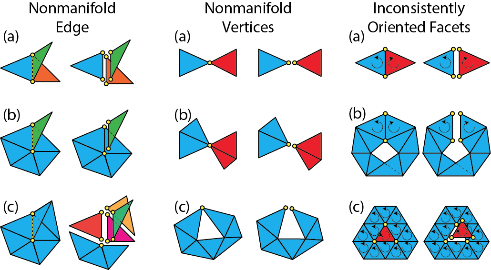

# Mesh Cleanup

Lagrange provides a collection of cleanup and repair utilities for detecting and
removing common mesh defects such as isolated vertices, duplicate elements,
degenerate facets, short/long edges, holes, and non-manifold configurations.

Unlike the [legacy cleanup functions](legacy-mesh-cleanup.md), which return a new
mesh, the current utilities operate on a [`SurfaceMesh`](mesh.md) object **in
place**:

```c++
lagrange::SurfaceMesh<Scalar, Index> mesh = ...;
lagrange::function_name(mesh); // `mesh` is modified in place.
```

Because most functions mutate the mesh directly, cleanup operations can be
applied sequentially to progressively repair a mesh.  (A few functions, such as
`detect_degenerate_facets`, are query-only and leave the mesh unchanged.)
Existing vertex/facet/corner/indexed attributes are carried over to the result
and updated as vertices and facets are added or removed.

Most functions take an optional `Options` struct to control their behavior.  All
options have sensible defaults, so the struct can be omitted when the defaults
are sufficient.

## Remove Isolated Vertices

An isolated vertex is a vertex that is not referenced by any facet.  Remove them
with `remove_isolated_vertices`:

```c++
#include <lagrange/mesh_cleanup/remove_isolated_vertices.h>

lagrange::remove_isolated_vertices(mesh);
```

## Remove Duplicate Vertices

Two vertices are considered duplicates if they have _exactly_ the same
coordinates.  To remove duplicate vertices:

```c++
#include <lagrange/mesh_cleanup/remove_duplicate_vertices.h>

lagrange::remove_duplicate_vertices(mesh);
```

The behavior can be refined with `RemoveDuplicateVerticesOptions`:

```c++
#include <lagrange/mesh_cleanup/remove_duplicate_vertices.h>

lagrange::RemoveDuplicateVerticesOptions options;

// Two vertices are duplicates only if their positions *and* all listed
// attributes match exactly.
options.extra_attributes = {mesh.get_attribute_id("color")};

// Only merge duplicate vertices that lie on the boundary.
options.boundary_only = true;

lagrange::remove_duplicate_vertices(mesh, options);
```

* `extra_attributes`: additional attributes that must also be equal for two
  vertices to be considered duplicates (e.g. only merge vertices sharing the same
  color).
* `boundary_only`: when `true`, only duplicate vertices on the boundary are
  merged.

## Remove Duplicate Facets

Two facets are duplicates if they are formed by the same set of vertices.  For
example, facet `[1, 2, 3]` is a duplicate of facet `[3, 2, 1]`.  To remove all
duplicate facets:

```c++
#include <lagrange/mesh_cleanup/remove_duplicate_facets.h>

lagrange::remove_duplicate_facets(mesh);
```

By default, orientation is ignored.  Set `consider_orientation` to keep facets
that differ only by orientation:

```c++
#include <lagrange/mesh_cleanup/remove_duplicate_facets.h>

lagrange::RemoveDuplicateFacetOptions options;
options.consider_orientation = true; // (0, 1, 2) and (2, 1, 0) are *not* duplicates.

lagrange::remove_duplicate_facets(mesh, options);
```

!!! warning "Facet Orientation"
    When orientation is ignored and a set of duplicate facets contains both
    orientations, the facets are removed based on the majority orientation: if
    both orientations appear equally often, all are removed; otherwise a single
    facet with the majority orientation is kept.

## Geometrically Degenerate Facets

A facet is _degenerate_ if all of its vertices are _exactly_ collinear (for a
triangle, this means its area is exactly zero).  Lagrange relies on exact
predicates for this test.

To detect degenerate facets without modifying the mesh, use
`detect_degenerate_facets`, which returns the indices of the degenerate facets:

```c++
#include <lagrange/mesh_cleanup/detect_degenerate_facets.h>

std::vector<Index> degenerate = lagrange::detect_degenerate_facets(mesh);
```

To remove them, use `remove_degenerate_facets`:

```c++
#include <lagrange/mesh_cleanup/remove_degenerate_facets.h>

lagrange::remove_degenerate_facets(mesh);
```

!!! note "Implementation details"
    `remove_degenerate_facets` currently assumes a triangle mesh.  Use
    [`triangulate_polygonal_facets`](mesh-utilities.md) first if the input mesh
    is not triangular.  Non-degenerate facets adjacent to degenerate ones may be
    split as a result of the removal.

## Topologically Degenerate Facets

A facet is _topologically_ degenerate if two or more of its corners refer to the
same vertex.  For example, triangle `[1, 1, 2]` is topologically degenerate.
This is a special case of degeneracy that can be detected from connectivity
alone:

```c++
#include <lagrange/mesh_cleanup/remove_topologically_degenerate_facets.h>

lagrange::remove_topologically_degenerate_facets(mesh);
```

## Remove Null Area Facets

Remove facets whose (unsigned) area falls at or below a threshold:

```c++
#include <lagrange/mesh_cleanup/remove_null_area_facets.h>

lagrange::RemoveNullAreaFacetsOptions options;
options.null_area_threshold = 0;            // Facets with area <= threshold are removed.
options.remove_isolated_vertices = true;    // Also remove any vertices left isolated.

lagrange::remove_null_area_facets(mesh, options);
```

* `null_area_threshold`: facets with unsigned area less than or equal to this
  value are removed.
* `remove_isolated_vertices`: when `true`, vertices left isolated by the removal
  are also removed.

## Remove Short Edges

Collapse all edges shorter than a given threshold:

```c++
#include <lagrange/mesh_cleanup/remove_short_edges.h>

Scalar threshold = 1e-3;
lagrange::remove_short_edges(mesh, threshold);
```

For finer control over which vertex is kept during a collapse and how much the
surrounding geometry is allowed to change, use `RemoveShortEdgesOptions`:

```c++
#include <lagrange/mesh_cleanup/remove_short_edges.h>

#include <numbers>

lagrange::RemoveShortEdgesOptions options;
options.threshold = 1e-3;

// Optional per-vertex importance: the vertex with the higher value survives a
// collapse. If left empty, importance is derived from local geometry.
options.vertex_importance_attribute_name = "importance";

// Reject a collapse if any surrounding facet normal would rotate by more than
// this angle. The default (pi/2) only rejects actual normal flips.
options.max_normal_deviation_angle = std::numbers::pi / 6;

lagrange::remove_short_edges(mesh, options);
```

## Split Long Edges

Refine a mesh by splitting edges longer than a target length:

```c++
#include <lagrange/mesh_cleanup/split_long_edges.h>

lagrange::SplitLongEdgesOptions options;
options.max_edge_length = 0.1f; // Edges longer than this are split.
options.recursive = true;       // Keep splitting until no edge exceeds the target.

lagrange::split_long_edges(mesh, options);
```

* `max_edge_length`: edges longer than this value are split.
* `recursive`: when `true`, splitting is repeated until no edge exceeds
  `max_edge_length` (splitting an edge introduces new edges that may themselves be
  too long).
* `active_region_attribute`: optional `uint8_t` facet attribute restricting
  splitting to a subset of facets.  If empty, all edges are considered.
* `edge_length_attribute`: name of the edge-length attribute to use; it is
  computed automatically if it does not already exist.

!!! note
    Only _long_ edges are split.  This differs from uniform refinement, where
    every edge is split.

## Split Obtuse Triangles

Iteratively split obtuse triangles by splitting their longest edge at the
projection of the opposite (obtuse) vertex:

```c++
#include <lagrange/mesh_cleanup/split_obtuse_triangles.h>

#include <numbers>

lagrange::SplitObtuseTrianglesOptions options;
options.max_angle = std::numbers::pi_v<float> / 2; // 90 degrees (the default).
options.max_iterations = 5; // Use 0 to iterate until convergence.

size_t num_splits = lagrange::split_obtuse_triangles(mesh, options);
```

* `max_angle`: triangles with an interior angle strictly larger than this value
  (in radians) are considered obtuse and split.
* `max_iterations`: maximum number of split passes; use `0` to iterate until no
  obtuse triangles remain.
* `active_region_attribute`: optional `uint8_t` facet attribute restricting which
  facets are checked.

The function returns the total number of splits performed.  Vertex attributes are
linearly interpolated along each split edge.

## Close Small Holes

Fill small topological holes in the mesh:

```c++
#include <lagrange/mesh_cleanup/close_small_holes.h>

lagrange::CloseSmallHolesOptions options;
options.max_hole_size = 16;      // Only close holes with at most this many boundary vertices.
options.triangulate_holes = true; // Triangulate the filled holes (otherwise fill with polygons).

lagrange::close_small_holes(mesh, options);
```

* `max_hole_size`: maximum number of boundary vertices a hole may have to be
  closed.
* `triangulate_holes`: when `true`, filled holes are triangulated; otherwise they
  are filled with a single polygon.

## Resolve Non-Manifoldness

Lagrange can convert a non-manifold mesh into a manifold one by "pulling apart"
non-manifold vertices and edges.  To resolve both non-manifold vertices and
edges:

```c++
#include <lagrange/mesh_cleanup/resolve_nonmanifoldness.h>

lagrange::resolve_nonmanifoldness(mesh);
```

!!! example "Implementation details"
    Here is an illustration describing how Lagrange "pulls apart" non-manifold
    vertices and edges:

    

If the mesh only contains non-manifold _vertices_ (no non-manifold edges and no
inconsistently oriented facets), the cheaper `resolve_vertex_nonmanifoldness` can
be used instead:

```c++
#include <lagrange/mesh_cleanup/resolve_vertex_nonmanifoldness.h>

lagrange::resolve_vertex_nonmanifoldness(mesh);
```

!!! warning
    `resolve_vertex_nonmanifoldness` assumes the input mesh contains **no**
    non-manifold edges or inconsistently oriented facets.  Use
    `resolve_nonmanifoldness` when either may be present.

## UV Cleanup

Lagrange offers two utilities for repairing UV parameterizations.

### Rescale UV Charts

Rescale each UV chart so that it is isotropic with respect to its 3D image:

```c++
#include <lagrange/mesh_cleanup/rescale_uv_charts.h>

lagrange::RescaleUVOptions options;
options.uv_attribute_name = "";       // Empty: use the first UV attribute found.
options.chart_id_attribute_name = ""; // Empty: compute charts from UV connectivity.
options.uv_area_threshold = 1e-6;     // Triangles below this UV area are ignored.

lagrange::rescale_uv_charts(mesh, options);
```

!!! warning "UV Chart Overlap"
    `rescale_uv_charts` may produce overlapping UV charts, and a repacking may be necessary.

### Unflip UV Triangles

Correct flipped UV triangles that arise from periodic parameterizations (e.g. the
cylindrical parameterization of a cylinder, which produces a strip of flipped
triangles):

```c++
#include <lagrange/mesh_cleanup/unflip_uv_triangles.h>

lagrange::UnflipUVOptions options;
options.uv_attribute_name = ""; // Empty: use the first indexed UV attribute.

lagrange::unflip_uv_triangles(mesh, options);
```

!!! note
    `unflip_uv_triangles` targets flipped triangles caused by periodic
    parameterization and is not intended for arbitrary flipped UV triangles.  It
    should be called after [`rescale_uv_charts`](#rescale-uv-charts).

!!! note
    If an entire UV chart is flipped, please use `unflip_uv_charts` instead.

See the [Mesh Cleanup][cleanup-ref] reference documentation for more details.

[cleanup-ref]: ../../{{ dox_folder }}/group__group-surfacemesh-cleanup.html

