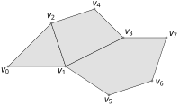
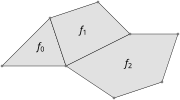
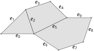
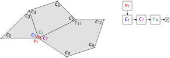
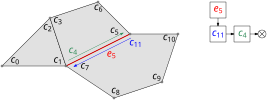

# Mesh Class

!!! attention
    Since v6.0.0, Lagrange introduced a new polygonal mesh class that is meant to replace the
    original mesh class used throughout Lagrange. While currently few of the Lagrange functions use
    this new mesh class, over time old and new features will transition to use this new data
    structure.

<!-- @header
#include <lagrange/SurfaceMesh.h>
#include <lagrange/Attribute.h>
#include <lagrange/views.h>
#include <lagrange/SurfaceMeshTypes.h>
#include <vector>
#include <random>
using Scalar = double;
using Index = uint64_t;

template <typename Scalar>
using RowMatrix = Eigen::Matrix<Scalar, Eigen::Dynamic, Eigen::Dynamic, Eigen::RowMajor>;
template <typename Scalar>
using ConstRowMatrixView = Eigen::Map<const RowMatrix<Scalar>, Eigen::Unaligned>;
-->

The [SurfaceMesh] class is the new generic mesh class in Lagrange to represent meshes. It is a very
generic class that supports triangle meshes, quad meshes, as well as quad-dominant and arbitrary
polygonal meshes. This new data structure was designed with a couple of key features in mind:

- **Generic and powerful API**:
    - A generic mesh API that works in 2D, 3D, ND with triangles/quad/hybrid meshes using the same
      [SurfaceMesh] type.
    - A simple API based on `std::span<>` (pointer + size). This avoids a lot of header-only
      template shenanigans, while providing a low-overhead but secure interface to manipulate
      continuous buffers.
- **Clean headers**:
    - The main `SurfaceMesh.h` header only pulls a few STL headers (`<memory>`, `<string_view>`,
      `<span>` and `<functional>` -- the last one can be avoided easily).
    - A separate header `views.h` allows to "view" mesh buffers as [Eigen] matrices (e.g., for easy
      interfacing with [libigl]).
    - A separate header `foreach_attributes.h` provides utility functions to iterate over mesh
      attributes.
- **Efficient memory usage**:
    - Generic **copy-on-write** mesh attributes (per vertex, facet, edge, etc.).
    - Efficient memory storage: a pure triangle/quad meshes only needs 2 buffers for vertex
      positions and facet indices, while hybrid meshes will use an additional offset buffer.
    - Mesh attributes can wrap external buffers (including const buffers), as long as memory layout
      is compatible. Policies determine write/growth behavior.
    - Mesh attributes can be exported in a `std::shared_ptr<>` to be transferred back to client
      code.
- **Dynamic editing capabilities**:
    - Mesh vertices and facets can be dynamically inserted and removed efficiently.
- **Powerful attribute system**:
    - Generic attribute system supporting any fixed-size integer types (`int8_t` ... `uint64_t`) and
      floating point types (`float`, `double`).
    - Attributes can be attached to any mesh element (vertex, facet, edge, corner), or can indexed
      by a secondary buffer (e.g. UVs).
    - Usage tag specifies how attributes are used and transformed (e.g. Color, Normals, UV, etc.).
- **Optional edge/connectivity attributes**:
    - Mesh edges can be numbered automatically, or based on a user-provided ordering.
    - Connectivity attributes allow efficient navigation around mesh elements (similar to
      half-edges).
- **Fast compilation times**[^1]:
    - Clean separation between class declaration/definition allows for faster build times.
    - Explicit template instantiation is used to limit available types usable with our
      `SurfaceMesh<>` and `Attribute<>` class.
    - [X macros] are used to facilitate explicit template instantiation of predetermined types (can
      be used by client code).
- **Extensive documentation**
    - Complete user guide (this document)
    - Full Doxygen API reference.

[^1]: Note that while the new polygonal mesh class is using explicit template instantiation to
    facilitate compilation, at the time most of Lagrange is still header-only and relying on our
    legacy mesh data structure. Thus overall compilation times still have room for improvement.

## Mesh Representation

At the core, our mesh data structure is just a collection of mesh elements (vertices, facets, edges,
corners), where each element is attached a number of [attributes](attributes.md). Specifically, we
define the following elements:

- **Vertices**: Points used to form the facets of the mesh. Typically associated with a 2D or 3D
  position attribute.

    { width="300" }

- **Facets**: Polygons formed by connecting mesh vertices together. In a triangle mesh, all facets
  are 3-gons.

    { width="300" }

- **Edges**: Edges are formed by unordered pairs of consecutive vertices in a mesh facet. The set of
  mesh edges is defined implicitly from the mesh facets. See [Mesh Edges](#mesh-edges) for more
  details.

    { width="300" }

- **Corners**: Facet corner elements can be used to reference vertices in a specific facet. Corners
  from the same facets are indexed contiguously in a flat list containing all facet corners.

    { width="300" }

Our mesh data structure is very generic, and can represent any kind of polygonal mesh, non-manifold
surface, mesh containing isolated vertices, point clouds, etc.

## Terminology

- **Regular mesh**: In the context of this documentation, a regular mesh is a mesh whose facets have
  the *same constant size*. E.g. a triangle mesh is a regular mesh (facet size = 3). So is a quad
  mesh (facet size = 4), a pentagonal mesh, etc.
- **Hybrid mesh**: A hybrid mesh is a mesh whose facets may have varying sizes. E.g. a quad dominant
  mesh is a hybrid mesh.
- **Vertex valence**: Number of facet corners pointing to a given vertex (repeated vertex indices in
  a degenerate facet will count multiple times towards the vertex valence).
- **Facet size**: Number of corners/vertices in a facet. Currently we require facet sizes to be > 2,
  but this restriction will be lifted in a future version (supporting facets of size 1 and 2).

A hybrid mesh will store an additional "offset" attribute for each facet, to determine where each
facet starts/ends in the attribute buffer storing vertex indices.

!!! example "Offset Indices"
    In the following mesh, facets `[f0, f1, f2]` have an "offset" attribute of `[0, 3, 7]`. This
    means that the first corner of `f0` is `c0`, the first corner of `f1` is `c3`, etc. The size of
    a facet can be computed from the difference between two consecutive offsets.

    { width="300" }
    { width="300" }


## Adding Vertices/Facets

Simple version:

```c++
lagrange::SurfaceMesh<Scalar, Index> mesh;
mesh.add_vertices(10); // adds 10 vertices with 0-initialized coordinates
mesh.add_triangles(3); // adds 3 triangles with 0-initialized vertex indices
mesh.add_quads(2); // adds 2 quads with 0-initialized vertex vertices
```

Another example:

```c++
lagrange::SurfaceMesh<Scalar, Index> mesh;
mesh.add_vertex({0.5, 0.2, 0.9}); // adds a vertex at (0.5, 0.2, 0.9)
mesh.add_triangle(1, 3, 4); // adds triangle (v1, v3, v3)
mesh.add_quad(1, 3, 4, 2); // adds quad (v1, v3, v4, v2)
mesh.add_polygon({1, 3, 4, 2, 5}); // adds polygon (v1, v3, v4, v2, v5)
```

To create a mesh from an existing buffer (with copy):

```c++
std::vector<Scalar> vertices; // flat buffer of size N x 3
std::vector<Index> facets; // flat buffer of size M x 3
// ... fill up vertices/facets ...
Index num_vertices = Index(vertices.size()) / 3;
Index num_facets = Index(facets.size()) / 3;

lagrange::SurfaceMesh<Scalar, Index> mesh;
mesh.add_vertices(num_vertices, vertices);
mesh.add_triangles(num_facets, facets);
```

Note that any continuous buffer of the appropriate size will work. If your input buffer is of type
`std::vector<std::array<Scalar, 3>>`, you will need to convert the pointer:

```c++
std::vector<std::array<Scalar, 3>> vertices;
lagrange::SurfaceMesh<Scalar, Index> mesh;
mesh.add_vertices(
    Index(vertices.size()),
    {vertices.empty() ? nullptr : vertices[0].data(), 3 * vertices.size()});
```

You can add multiple polygonal facets with different sizes in the same function call by using the
`add_hybrid()` method. While this method can take an existing buffer as input, it may be simpler to
use it via user-defined callbacks:

```c++
lagrange::SurfaceMesh<Scalar, Index> mesh;
std::mt19937 gen;
std::uniform_int_distribution<Index> random_facet_size(3, 6);
std::uniform_int_distribution<Index> random_vertex_index(0, 9);
std::uniform_real_distribution<Scalar> random_position(0, 1);
mesh.add_vertices(10, [&](Index, lagrange::span<Scalar> p) {
    p[0] = random_position(gen);
    p[1] = random_position(gen);
    p[2] = random_position(gen);
});
mesh.add_hybrid(4,
    // The first callback determines the degree of facet `f`
    [&](Index f) { return random_facet_size(gen); },
    // The second callback sets the mapping corner id -> vertex id for facet `f`
    [&](Index f, lagrange::span<Index> t) {
        for (Index i = 0; i < t.size(); ++i) {
            // Assign a random vertex id to each facet corner
            t[i] = random_vertex_index(gen);
        }
});
```

!!! tip "Wrapping External Buffers ans Eigen Matrices"
    Please read our dedicated section on [wrapping external
    buffer](../attributes/#wrapping-external-buffers), as well as our documentation on
    [SharedSpan](../general-utilities/#shared-span) for tracking ownership of shared objects when
    wrapping external buffers.

## Removing Vertices/Facets

!!! attention "Batch Removal Only"
    Currently, we only support efficient **batch** removal of vertices/facets. This is because
    removing any mesh element will cause **reindexing** of **all** mesh attributes referencing a
    mesh element (e.g. vertex indices). To allow for "lazy" deletion, you can use an attribute to
    keep track of "deleted" vertices/facets until you actually clean them up. An element removal is
    a **O(|V| + |F|)** operation.

To remove a list of vertices/facets:

```c++
lagrange::SurfaceMesh<Scalar, Index> mesh;
mesh.add_vertices(20);
mesh.add_triangles(12);

// Remove vertices v2, v5 and v9
mesh.remove_vertices({2, 5, 9});

// Remove facets v6, v2 and v8
mesh.remove_facets({6, 2, 8});
```

Alternatively, you can use a filter returning a boolean value to determine the vertices/facets to
remove:

```c++
lagrange::SurfaceMesh<Scalar, Index> mesh;
mesh.add_vertices(20);
mesh.add_triangles(12);

// Remove vertices with even index
mesh.remove_vertices([](Index v) { return (v % 2 == 0); });

// Remove random facets
std::mt19937 gen;
std::uniform_int_distribution<int> flip_coin(0, 1);
mesh.remove_facets([&](Index f) { return flip_coin(gen) == 1; });
```

!!! note "Vertex Removal"
    Removing a vertex will automatically remove any facet containing that vertex!

!!! note "Facet Removal"
    Removing a facet will **not** automatically remove any incident vertex. You can end up with
    floating/isolated vertices after facet removal. Consider filtering them as a post-processing.

## Copy-On-Write

All mesh data is stored in an [Attribute] object, including vertex positions, facet indices, etc.
These mesh attributes are handled via a copy-on-write mechanism, meaning that copying a mesh is a
cheap operation by default: no buffer is actually duplicated until you start writing to it. For this
reason, we distinguish most accessors between **getters** and **setters**:

- **Getters** start with `get_xxx()` and provide read-only access to an attribute data. They will
  not cause any copy.
- **Setters** start with `ref_xxx()` and will cause an immediate buffer copy if the buffer is not
  uniquely owned (i.e. there are more than 1 object referencing the same buffer).

Note that both getters and setters are **safe to use concurrently**. Please read our ["note on
thread-safety"](#a-note-on-thread-safety) for more information.

See below for a short example:

```c++
lagrange::SurfaceMesh<Scalar, Index> mesh;
// ... Fill up mesh ...
lagrange::SurfaceMesh<Scalar, Index> copy = mesh;

// Writable reference to a vertex
auto p = copy.ref_position(1); // <-- leads to a copy of the vertex buffer
p[0] = 0.1;
p[1] = 0.2;
p[2] = 0.3;

// Now vertices v1 are different
std::equal(
    mesh.get_position(1).begin(),
    mesh.get_position(1).end(),
    copy.get_position(1).begin()); // --> false

// The pointers to the vertex positions are now different
mesh.get_vertex_to_position().get_all().data() ==
    copy.get_vertex_to_position().get_all().data(); // --> false

// But the pointers to the facet indices are still the same
mesh.get_corner_to_vertex().get_all().data() ==
    copy.get_corner_to_vertex().get_all().data(); // --> true
```

## Eigen Matrix Views

Mesh attributes such as positions and facet indices can be views as [Eigen] matrices. Specifically,
we provide read-only views as `Eigen::Map<const ...>`:

<!-- @views -->
```c++
#include <lagrange/SurfaceMesh.h>
#include <lagrange/views.h>

#include <igl/massmatrix.h>

lagrange::SurfaceMesh<Scalar, Index> mesh;

// Fill up mesh data...

// With ADL, no need to prefix by lagrange::
auto V_view = vertex_view(mesh);
auto F_view = facet_view(mesh);

// Call your favorite libigl function
Eigen::SparseMatrix<Scalar> M;
igl::massmatrix(V_view, F_view, igl::MASSMATRIX_TYPE_VORONOI, M);
```

Writable reference are also available:

<!-- @views -->
```c++
// Writable reference, creates a copy if buffer is not uniquely owned
auto V_ref = vertex_ref(mesh);
auto F_ref = facet_ref(mesh);

// Center mesh around vertex barycenter
V_ref.rowwise() -= V_ref.colwise().mean();
```

!!! note "Regular Meshes Vs Hybrid Meshes"
    On hybrid meshes, it is not possible to "view" facet indices as a 2D matrix. This is because
    each "row" of the matrix would have a variable width, due to the varying facet sizes. For this
    reason, trying to get a `facet_view()` on a hybrid mesh will throw a runtime exception.

## Mesh Edges

By default, a mesh object is very lightweight, and does not compute edge ids or connectivity
information. If this information is desirable, it is possible to compute it by calling the
`initialize_edges()` method:

<!-- @edges -->
```c++
lagrange::SurfaceMesh<Scalar, Index> mesh;
mesh.add_vertices(10);
mesh.add_triangle(0, 1, 2);
mesh.add_quad(1, 3, 4, 2);
mesh.add_polygon({0, 2, 4, 5, 6});

// Let Lagrange assign an id to each edge
mesh.initialize_edges();

// ...

// Once edge data is no longer needed, clear related mesh attributes:
mesh.clear_edges();
```

In practice, edge and connectivity data are stored as special mesh attributes, which can be
accessed/edited like any other mesh attribute!

If a specific ordering of the mesh edges is desired, provide it to the `initialize_edges()` method:
<!-- @edges -->
```c++
// Explicit edge id -> vertex ids mapping
const std::vector<std::array<Index, 2>> edges = {
    {0, 1},
    {1, 3},
    {3, 4},
    {4, 5},
    {5, 6},
    {6, 0},
    {1, 2},
    {2, 0},
    {2, 4},
};
// Passed to the mesh via a std::span<>
mesh.initialize_edges({&edges[0][0], 2 * edges.size()});
```

!!! warning "Redundant Initialization"
    If a mesh already contains edges information, `mesh.initialize_edges()` will not do anything. If
    you want to reorder existing edges, please clear edge attributes first, and re-initialize mesh
    edges.

## Connectivity And Navigation

!!! danger "Connectivity And Edge Information"
    Navigating between adjacent and incident mesh elements requires building **connectivity
    information**. Since such connectivity information is necessary to uniquely **index mesh
    edges**, the two set of attributes are tied together. In practice, this means that calling any
    mesh navigation method requires having called `mesh.initialize_edges()` beforehand.

To efficiently navigate between adjacent facets, or between incident vertex/facets, we store
"chains" of corners around vertices and edges as single-linked lists as follows:

- **Corners Around A Vertex**. The chain of corners around a vertex can be represented by two
  attributes. One vertex attribute giving the head of each list, and one corner attribute giving the
  next corner in the linked list for each "chain" around a vertex. Since each corner belongs to one
  chain only, we can store all linked lists as flattened attribute for the entire mesh.

    { width="600" }


    !!! note "Edges Around A Vertex"
        To iterate over the edges incident to a given vertex, you will notice that we only provide a
        single method `foreach_edge_around_vertex_with_duplicates()`. This method will call the
        callback function repeatedly for each facet which contains an incident edge to the
        prescribed vertex.

- **Corners Around An Edge**. The same principle can be applied to chain corners around a given
  edge. Note that since the facets are oriented, we only chain one canonical corner per facet around
  a given edge.

    { width="600" }

    !!! hint "Non-Manifold Edges"
        A nice advantage of this connectivity representation is that we support any type of
        non-manifold meshes. This is in contrast with most half-edge data structure implementations
        which assume manifold surfaces.

To navigate around a mesh element (vertices/edges), we provide convenience functions
`foreach_xxx_around_xxx()`:

```c++
lagrange::SurfaceMesh<Scalar, Index> mesh;

// Fill up mesh...

// Compute vertex valence
std::vector<Index> vertex_valence(mesh.get_num_vertices(), 0);
for (Index v = 0; v < mesh.get_num_vertices(); ++v) {
    mesh.foreach_facet_around_vertex(v, [&](Index f) {
        ++vertex_valence[v];
    });
}
```

In the example above, we could have use the method `count_num_corners_around_vertex()` to
compute vertex valence directly. See [SurfaceMesh] class documentation for a full reference.

!!! danger "Degenerate Facets"
    If a mesh facet is degenerate, and references the same vertex several time (e.g. facet `f2 =
    (0, 1, 1)`), then `mesh.foreach_facet_around_vertex(1)` will call the facet `f2` twice.


## Half-Edges

There is a natural correspondence between the usual half-edge notion and a facet corner (see figure
below). While Lagrange currently does not offer half-edge data-structure for mesh navigation, corner
indices can be used to navigate around mesh elements the same way a half-edge data structure does.

<figure>
  <div style="display:flex">
    <div>
      
    </div>
    <div>
      
    </div>
  </div>

  <figcaption>Half-edges can be identified with their equivalent facet corners.</figcaption>
</figure>

!!! tip "Twin Half-Edge"
    To implement the `twin(h_i)` operation, you can use `SurfaceMesh::get_next_corner_around_edge()`.

In the future we may add a half-edge "proxy" structure to facilitate mesh navigation.

## Supported Types

While our `SurfaceMesh<>` class is templated by both a `Scalar` and `Index` type, we only actually
support a finite set of template parameters. Specifically:

- **Scalar** can only be `float` or `double`.
- **Index** can only be `uint32_t` or `uint64_t`.

We provide the following type aliases for convenience:

| Alias | Actual Type |
|---|---|
| `SurfaceMesh32f` | `SurfaceMesh<float, uint32_t>`  |
| `SurfaceMesh32d` | `SurfaceMesh<double, uint32_t>` |
| `SurfaceMesh64f` | `SurfaceMesh<float, uint64_t>`  |
| `SurfaceMesh64d` | `SurfaceMesh<double, uint64_t>` |

!!! warning "Linking Error for Unsupported Types"
    If you try to use our `SurfaceMesh<>` class with an unsupported Scalar/Index type,
    you will encouter a linking error due to unreferenced symbols.

!!! tip "Writing Functions Taking SurfaceMesh As Parameter"
    To write a function taking a `SurfaceMesh<>` as a parameter, you can use our [X macros] to
    explicitly instantiate a templated function with the supported mesh types. For example, the
    `vertex_view()` function is instantiated as follows:

    <!-- TODO: Add localized code preamble... -->

    ```c++
    ////////////////
    // In views.h //
    ////////////////

    template <typename S, typename I>
    ConstRowMatrixView<S> vertex_view(const SurfaceMesh<S, I>& mesh);

    //////////////////
    // In views.cpp //
    //////////////////

    template <typename S, typename I>
    ConstRowMatrixView<S> vertex_view(const SurfaceMesh<S, I>& mesh)
    {
        // Function definition
        return {};
    }

    // Explicit template instantiation
    #define LA_X_views_mesh(_, S, I) \
        template ConstRowMatrixView<S> vertex_view(const SurfaceMesh<S, I>& mesh);
    LA_SURFACE_MESH_X(views_mesh, 0)
    ```

[SurfaceMesh]: ../../../{{ dox_folder }}/classlagrange_1_1_surface_mesh.html
[X macros]: ../../../{{ dox_folder }}/group__group-surfacemesh.html
[Attribute]: ../../../{{ dox_folder }}/classlagrange_1_1_attribute.html
[Eigen]: http://eigen.tuxfamily.org
[libigl]: https://libigl.github.io/
